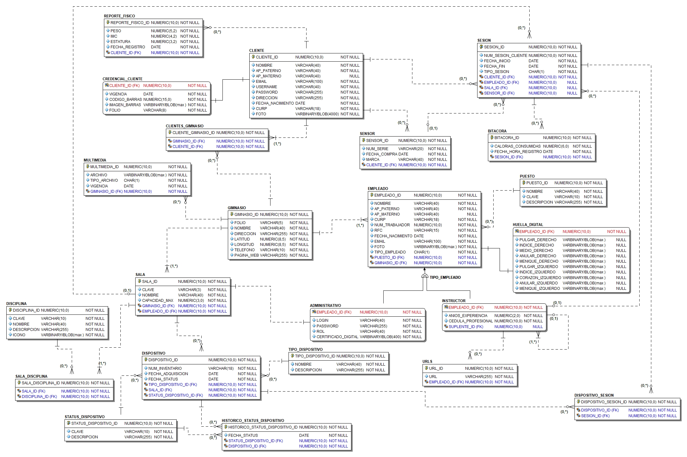

# 🗃Proyecto Final BDA: Virtual Gym 🏋️‍♂️

Integrantes: 

- Jorge Cárdenas Cárdenas
- Samuel Arturo Garrido Sánchez

#### Reglas de negocio.

Blablabla

### Modelo lógico

### Usuarios

### Tabla de Scripts

| Num. Script | Nombre del Script | Descripción |
|:-----------:|:-----------------:|:-----------:|
|1|s-01-creacion-bd.sql|Creación de la BD con los parámetros indicados|

#### Configuración inicial de la BD

| Configuración | Descripción y/o configuración |
|:-----------:|:-----------------:|:-----------:|
|Número y ubicación de archivos de control|  |

### Módulos del sistema

| Nombre del módulo | Descripción | Usuario |
|--|--|--|
| CLIENTE | Agrupa toda la información en forma de objetos de los clientes. | user_cliente |
| INFRAESTRUCTURA | Corresponde a todos los objetos relacionados con la infraestructura del gimnasio, como las salas, disciplinas impartidas y dispositivos para hacer ejercicios | user_infraestructura |
| EMPLEADO| Contiene la información (datos personales, biométricos, puesto y/o rol) de los empleados que trabajan en el gimnasio | user_empleado |

### Diseño lógico de la Base de Datos 

| Nombre de la tabla | Nombre del módulo  |
|--|--|
| CLIENTE | CLIENTE |
| CREDENCIAL_CLIENTE | CLIENTE |
| REPORTE_FISICO | CLIENTE | 
| SENSOR | CLIENTE |
| SESION | CLIENTE|
| BITACORA | CLIENTE |
| GIMNASIO | INFRAESTRUCTURA |
| MULTIMEDIA | INFRAESTRUCTURA |
| SALA | INFRAESTRUCTURA |
| DISCIPLINA | INFRAESTRUCTURA |
| SALA_DISCIPLINA | INFRAESTRUCTURA |
| DISPOSITIVO | INFRAESTRUCTURA |
| TIPO_DISPOSITIVO | INFRAESTRUCTURA |
| STATUS_DISPOSITIVO | INFRAESTRUCTURA |
| HISTORICO_STATUS_DISPOSTIVO | INFRAESTRUCTURA |
| APARATO_SESION | INFRAESTRUCTURA |
| CLIENTE_GIMNASIO | INFRAESTRUCTURA |
| EMPLEADO | EMPLEADO |
| PUESTO_ID | EMPLEADO |
| HUELLA_DIGITAL | EMPLEADO |
| ADMINISTRADOR | EMPLEADO |
| INSTRUCTOR | EMPLEADO |
| URLS | EMPLEADO |

### Esquema de Indexado
| Nombre de la tabla | Nombre del indice | Tipo | Propósito |
|--|--|--|--|
| cliente | cliente_username_uk | unique | Validar que no se repitan los nombres de usuario y optimizar las búsquedas |
| cliente | cliente_curp_uk | unique | Validar que no se repitan las curps de los usuarios |
| credencial_cliente | credencial_cliente_codigo_barras_uk | unique | Asegurar que no se repitan códigos de barras y generar consultas eficientes |
| sensor| sensor_num_serie_uk | unique | Asegurar la integridad de los números de serie de los sensores |
| puesto | puesto_clave_uk | unique | Mantener la integridad entre las claves de los puestos |
| gimnasio| gimnasio_folio_uk | unique | Validar la integridad y generar consultas eficientes |
| empleado | empleado_curp_uk | unique | Validar la integridad y asegurar consultas eficientes |
| empleado | empleado_rfc_uk | unique | Validar la integridad y asegurar consultas eficientes |
| empleado | empleado_email_uk | unique | Validar la integridad y asegurar consultas eficientes |
| administrativo | administrativo_login_uk | unique | Validar la integridad y asegurar consultas eficientes |
| sala | sala_clave_uk | unique | Validar la integridad y asegurar consultas eficientes |
| disciplina | disciplina_clave_uk | unique | Validar la integridad y asegurar consultas eficientes |
| status_dispositivo | status_dispositivo_uk | unique | Validar la integridad y asegurar consultas eficientes |

### Tablespaces 
| Nombre del tablespace | Configuración  |
|--|--|
| tbs_cliente |``DATAFILE '/disco/disco01/cliente/datafile.dbf' SIZE 1024M AUTOEXTEND ON NEXT 102400K MAXSIZE 2097152K`` |

|

### Choro consciente

Considerando que tenemos la cantidad de 1500 personas por los mil gimnasios, damos un promedio con base a la estadística de movimiento urbano que un promedio de 40 personas en aforo promedio, que cuenten con sensor, estarán yendo 2 horas diarias. Esto, multiplicado por los 1000 gimnasios nos da una cantidad de 4,800,000 registros en la bitácora que se realizarán. Si esto lo multiplicamos por el tamaño de una tupla que es de 23 bytes, y convirtiéndolo a MB, tendremos que diariamente tendremos la siguiente cantidad de datos:

40\*(1000\*23\*120)/(1024**2) = 105.285 Mb (diarios)

Considerando que el horario del gimnasio sea de 10am a 10 pm, tendremos que finalmente tendremos una consulta de 55-56 por segundo.

40000/(12*60) = 55.5 datos por min aprox.

(23\*1500\*60)/1024*\*2\*120

Para la consultas, serán de 40,000 consultas diarias de reportes de bitácoras, con 

En el caso de 
<!--stackedit_data:
eyJoaXN0b3J5IjpbMTYyNTY0Nzg1OF19
-->